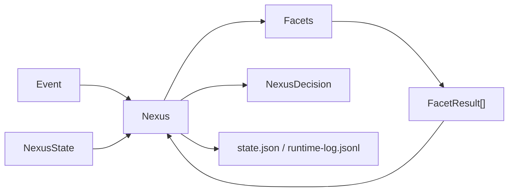

# Fullerene - architecture

This file gives shared names and intent from the product description so the harness stays consistent. It is not the only source of truth; keep it aligned with the implemented runtime as code lands.

## High-level shape

| Pillar | Meaning |
|--------|---------|
| State | Memory, goals, world model, and other structured runtime state |
| Control | Policy, confidence, and verification boundaries |
| Signal | Facets contribute observations, updates, and proposals |
| Execution | Planner and executor remain future components; v0 does not perform autonomous side effects |

## Facets (twelve)

Product vocabulary for modular components:

1. Memory
2. Affect
3. Attention
4. Context
5. World Model
6. Goals
7. Policy
8. Planner
9. Executor
10. Verifier
11. Confidence
12. Learning

Harness note: treat each as an interface-friendly boundary in design discussions. The first runtime slice only implements the facet contract plus a tiny example facet.

## Nexus loop (current v0)

- Accept an event plus the current runtime state.
- Pass the event and state through registered facets.
- Collect structured `FacetResult` objects.
- Integrate those results into a small `NexusDecision` (`WAIT`, `ASK`, `ACT`, `RECORD`).
- Persist the updated runtime snapshot plus an append-only event log.
- Avoid autonomous tool execution; `ACT` is only a typed decision for now.

## Data stores (current v0)

- **Local JSON files** - `state.json` snapshot plus `runtime-log.jsonl` under an explicit state directory.
- **SQLite memory store** - `memory.sqlite3` under the same state directory is the canonical store for what the system remembers.

## Memory v0

- **Working memory** - derived from a bounded set of recent memory records; it is not a separate giant prompt file.
- **Episodic memory** - append-only records of observed events; this is the first real source-of-truth memory layer.
- **Semantic memory** - supported as a typed record in the schema, but v0 does not yet automate rich semantic extraction.
- **Retrieval** - deterministic only: keyword overlap, tag overlap, salience, and recency. No embeddings, vector DB, summarization, RAG, or model calls.
- **Inspection** - memory remains readable through SQLite rows and bounded facet metadata instead of opaque compressed blobs.

## Memory v1 (current)

- **Deterministic tag extraction** - `fullerene/memory/inference.py` declares a small lowercase rule table (communication, authority, urgent, hard-rule-candidate, bug, verification, memory, goals, policy). Matching is case-insensitive with token boundaries so "lead" does not fire on "leader".
- **Deterministic salience scoring** - base 0.3 plus transparent boosts for direct user-instruction language, strong/emphasis words, `hard-rule-candidate` tags, `urgent` tags, and correction/negative-feedback terms. The total is clamped to `[0.0, 1.0]`. `explain_salience` returns the per-signal breakdown for inspection.
- **MemoryFacet integration** - on store, the facet infers tags, merges them with any explicit metadata-supplied tags (explicit tags retain priority), computes salience, and persists `metadata_tags`, `inferred_tags`, and `salience_breakdown` alongside the record for inspection.
- **Retrieval explanation** - `score_memory_record` is unchanged in formula (keyword 0.5, tag 0.2, salience 0.2, recency 0.1) but now backed by `explain_score`, which exposes the per-component breakdown. Retrieval is still bounded; Nexus context never loads all memory.
- **Out of scope** - no embeddings, no vector DB, no model calls, no prosody. Future affect/prosody may influence salience, but is not implemented yet.

## Memory roadmap

- **v1** - better deterministic scoring, tagging rules, and salience heuristics. **Current.**
- **v2** - embeddings / vector retrieval as a non-canonical index layered on top of SQLite.
- **v3** - memory links / graph structure, reflection or compression, and affect-weighted salience.

## Model integration (current v0)

- None yet. Nexus is model-agnostic and does not call any provider in the first runtime slice.

## Conceptual diagram

## Verified mapping

| Component | Path / package | Notes |
|-----------|----------------|-------|
| Nexus | `fullerene/nexus/runtime.py` | `Nexus` / `NexusRuntime` event loop |
| Event and decision models | `fullerene/nexus/models.py` | Typed dataclasses for events, results, decisions, state, and records |
| Facet interface | `fullerene/facets/base.py` | `Facet` protocol |
| Example facet | `fullerene/facets/echo.py` | Small bundled facet for smoke/testing |
| Memory facet | `fullerene/facets/memory.py` | Deterministic episodic storage with v1 tag/salience inference plus bounded retrieval |
| Memory models and store | `fullerene/memory/` | `MemoryRecord`, scoring helpers, deterministic tag/salience inference (`inference.py`), and SQLite-backed canonical memory |
| State store | `fullerene/state/store.py` | In-memory or file-backed JSON persistence |
| CLI | `fullerene/cli.py`, `fullerene/__main__.py` | `python -m fullerene` |
