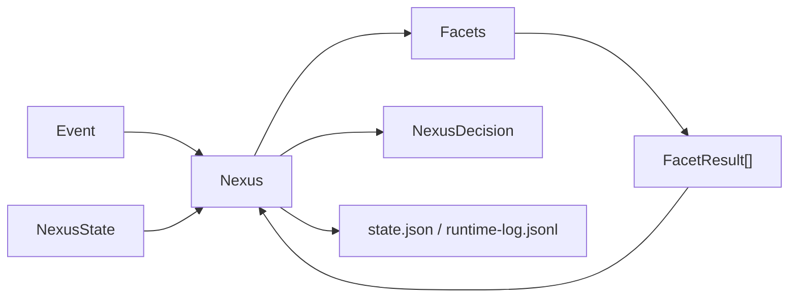

# Fullerene - architecture

This file gives shared names and intent from the product description so the harness stays consistent. It is not the only source of truth; keep it aligned with the implemented runtime as code lands.

## High-level shape

| Pillar | Meaning |
|--------|---------|
| State | Memory, goals, world model, and other structured runtime state |
| Control | Behavior, policy, and verification boundaries |
| Signal | Facets contribute observations, updates, and proposals |
| Execution | Planner v0 proposes inspectable plans; Executor v0 can execute approved internal-only actions with dry-run default and no external side effects |

## Facets (twelve)

Product vocabulary for modular components:

1. Memory
2. Affect
3. Attention
4. Context
5. World Model
6. Goals
7. Policy
8. Planner
9. Executor
10. Verifier
11. Behavior
12. Learning

Harness note: treat each as an interface-friendly boundary in design discussions. The current runtime implements `MemoryFacet`, `GoalsFacet`, `WorldModelFacet`, `BehaviorFacet v0`, `PolicyFacet v0`, `PlannerFacet v0`, `ExecutorFacet v0`, `VerifierFacet v0`, `ContextFacet`, and `EchoFacet`; `BehaviorFacet v0` covers the first deterministic decision-selection role, `PolicyFacet v0` enforces deterministic permission boundaries, `PlannerFacet v0` proposes deterministic inspectable plans, `ExecutorFacet v0` performs approved internal-only execution with dry-run default, and `VerifierFacet v0` runs deterministic post-decision inspection before persistence.

## Nexus loop (current v0)

- Accept an event plus the current runtime state.
- Pass the event and state through registered facets.
- Collect structured `FacetResult` objects.
- Integrate those results into a small initial `NexusDecision` (`WAIT`, `ASK`, `ACT`, `RECORD`), using explicit proposal priority `ACT > ASK > RECORD > WAIT` when multiple facets disagree.
- Apply policy guardrails before finalizing the initial action: policy `DENIED` results force `RECORD`, and policy `APPROVAL_REQUIRED` results force `ASK`, even if another facet proposed `ACT`.
- Run deterministic verifier checks against the event, facet results, initial decision, and configured state-dir metadata. Unsafe or structurally invalid `ACT` decisions may be downgraded to `ASK` or `RECORD` before persistence.
- Persist the updated runtime snapshot plus an append-only event log, including verifier metadata as a `FacetResult`.
- Avoid autonomous external tool execution; `ACT` is still only a typed decision, and Executor v0 only records or applies approved internal state actions.

## Data stores (current v0)

- **Repository state** - Process-local files (default CLI `--state-dir`, unit test DBs, manual smoke directories) live under gitignored `state/` at the repo root; use `fullerene.workspace_state` instead of creating new dot-directories beside the project. World model test DBs go under `state/world_model_storage/`, parallel to `mem_storage/` and `goals_storage/`.
- **Local JSON files** - `state.json` snapshot plus `runtime-log.jsonl` under an explicit state directory.
- **SQLite memory store** - `memory.sqlite3` under the same state directory is the canonical store for what the system remembers.
- **SQLite goals store** - `goals.sqlite3` under the same state directory is the canonical store for explicit goals.
- **SQLite world model store** - `world.sqlite3` under the same state directory is the canonical store for explicit beliefs about reality.
- **SQLite policy store** - `policy.sqlite3` under the same state directory is the canonical store for explicit user/system policy rules.

## Memory v0

- **Working memory** - derived from a bounded set of recent memory records; it is not a separate giant prompt file.
- **Episodic memory** - append-only records of observed events; this is the first real source-of-truth memory layer.
- **Semantic memory** - supported as a typed record in the schema, but v0 does not yet automate rich semantic extraction.
- **Retrieval** - deterministic only: keyword overlap, tag overlap, salience, and recency. No embeddings, vector DB, summarization, RAG, or model calls.
- **Inspection** - memory remains readable through SQLite rows and bounded facet metadata instead of opaque compressed blobs.

## Memory v1 (current)

- **Deterministic tag extraction** - `fullerene/memory/inference.py` declares a lowercase rule table for `communication`, `authority`, `urgent`, `hard-rule-candidate`, `bug`, `verification`, `memory`, `goals`, `policy`, and `correction`. Matching is case-insensitive with token boundaries, with smart-quote normalization so `don't` behaves the same whether the apostrophe is straight or curly.
- **Deterministic salience scoring** - base `0.3`, plus `+0.2` for user messages, `+0.2` for `hard-rule-candidate`, `+0.1` for `urgent`, `+0.2` for `correction`, `+0.1` for `authority`, and `+0.05` for `communication`. The total is clamped to `[0.0, 1.0]`. `explain_salience` returns the per-signal breakdown for inspection.
- **MemoryFacet integration** - on store, the facet infers tags from `event.content`, merges them with any explicit metadata-supplied tags (explicit tags retain priority), computes salience from the merged tag set, and persists `metadata_tags`, `inferred_tags`, and `salience_breakdown` alongside the canonical `MemoryRecord.tags` and `MemoryRecord.salience` fields.
- **Retrieval explanation** - `score_memory_record` still uses keyword 0.5, tag 0.2, salience 0.2, and recency 0.1, and `explain_score` exposes the per-component breakdown. Query-side tag overlap also uses deterministic content-inferred tags, so retrieval can benefit from tag matches even when the caller did not pass explicit metadata tags.
- **Out of scope** - no embeddings, no vector DB, no model calls, no RAG, no voice/prosody features.

## Memory roadmap

- **v1** - better deterministic scoring, tagging rules, and salience heuristics. **Current.**
- **v2** - embeddings / vector retrieval as a non-canonical index layered on top of SQLite.
- **v3** - memory links / graph structure, reflection or compression, and affect-weighted salience.

## Context v0 (current)

- **Static working packet only** - `ContextFacet` assembles a small inspectable context window for the current run. It is deliberately boring and deterministic.
- **Source material** - only the recent `N` episodic memory records are included. No goals, world model, policy, planner, or verifier data are assembled into Context v0.
- **Bounded retrieval only** - context uses `MemoryStore.list_recent(limit=N, memory_type=episodic)` and does not scan or load all memory.
- **No dynamic assembly** - no salience cutoff, no pressure system, no embeddings, no vector search, no LLM summarization, and no context compression.
- **Manual runtime scope** - the CLI enables context explicitly with `--context`, and `--context-window-size` controls the static bound.
- **Read-only role** - Context v0 is the current working packet available to Nexus and future reasoning systems; it is not a planner, reasoning engine, retrieval model, or executor.

## Context roadmap

- **v0** - static working memory window from recent episodic records only. **Current.**
- **v1** - dynamically assembled from active facets, pulling current goals, recent memories, and a world-model snapshot under deterministic scoping rules. **Future.**
- **v2** - relevance-filtered and pressure-relevant assembly with cluster-informed inclusion and salience cutoffs instead of arbitrary `N`. **Future.**
- **v3** - self-editing context, semantic consolidation, predictive loading, and pressure signaling when the context window overloads. **Future.**

## Behavior v0 (current)

- **Deterministic and model-free** - `BehaviorFacet` does not call an LLM, planner, graph, executor, or external policy engine.
- **Current role in the 12-facet vision** - this is the first implemented deterministic decision-policy layer; it is intentionally narrow and inspectable.
- **Inputs** - event type/content, explicit event metadata, deterministic tag inference, deterministic salience, and any passed-through memory metadata when the caller provides it.
- **Outputs** - a proposed `WAIT` / `RECORD` / `ASK` / `ACT` decision plus inspectable metadata (`selected_decision`, `confidence`, `salience`, `tags_considered`, and `reasons`).
- **Inspectable confidence only** - `confidence` and `confidence_breakdown` are deterministic trace fields for inspection/debugging, not probabilistic ML confidence or model uncertainty.
- **Conservative policy** - empty/no-signal events wait; normal user messages record; response/uncertainty signals ask; explicit low-risk actions can propose `ACT`.
- **No execution** - `ACT` is only a typed proposal for a future executor; Nexus v0 still performs no autonomous tool execution or irreversible side effects.

## Planner v0 (current)

- **Deterministic and model-free** - `fullerene/planner/` plus `PlannerFacet` do not call an LLM, embedding system, graph engine, executor, or external tool.
- **Trigger scope only** - Planner v0 runs only for explicit plan requests (`request_plan` or simple planning phrases) or when a high-priority active goal is present and the current event explicitly asks for next steps.
- **Inputs** - active goals from the optional goals store, active beliefs from the optional world-model store, policy constraints when a policy store is available, and a simple pressure signal taken from `event.metadata["pressure"]`, then `event.metadata["salience"]`, then current behavior confidence, else `0.0`.
- **Outputs** - a proposed `Plan` with ordered `PlanStep` rows, inspectable `confidence`, `pressure`, `reasons`, and step-level `risk_level` / `requires_approval` / `policy_status` metadata.
- **Pressure behavior** - pressure >= `0.7` yields a shorter, more direct 2-step plan and lowers the proposal threshold slightly; lower pressure yields up to 3 clarifying or exploratory steps.
- **Policy filtering** - Planner v0 can evaluate steps through the existing policy logic when a policy store is configured; denied steps are marked `blocked`, approval-gated steps are marked `requires_approval`, and high-risk steps require approval even without an explicit policy match.
- **Verifier visibility** - Planner does not approve or execute anything. It marks risk and approval requirements so verifier checks and future executor work can inspect them later.
- **No execution or tool calls** - Planner v0 never emits tool execution, shell/network/git use, or autonomous side effects.

## Planner roadmap

- **v0** - deterministic, no LLM, explicit-request or high-priority-goal trigger, policy-filtered inspectable `Plan` / `PlanStep` output, no execution. **Current.**
- **v1** - context-aware planning, multi-goal planning, and plan memory. **Future.**
- **v2** - LLM-assisted step generation, hierarchical plans, and world-model uncertainty signals that can require approval. **Future.**
- **v3** - predictive planning, plan evaluation loops, and adversarial checking. **Future.**

## Executor v0 (current)

- **Internal actions only** - `fullerene/executor/` plus `ExecutorFacet` accept planner output and execute only inspectable internal actions: `noop`, `emit_event`, `update_goal`, `update_belief`, and dry-run-only `update_memory`.
- **Explicit handler registry only** - Executor v0 uses an explicit `ActionType -> handler` mapping. It does not infer actions from `target_type`, parse natural language descriptions, or guess missing behavior.
- **Dry-run default** - execution happens only when `event.metadata["execute_plan"]` is true, and it stays in dry-run mode unless `event.metadata["dry_run"] == false`.
- **Conservative preflight** - Executor v0 halts before mutation when any step is blocked, requires approval, is high-risk, targets an unsupported or external target type, or declares an unsupported action type.
- **Loud failure semantics** - unknown actions fail with `unsupported_action_type`; unsupported or external targets fail with `unsupported_target_type`; live-only gaps fail with `unsupported_live_action`; runtime handler exceptions fail with `execution_failed`.
- **No partial execution** - the runner validates the full plan first, then executes; if one step is refused, later steps are not attempted and earlier live mutations do not occur.
- **Every action logged** - execution produces structured `ExecutionRecord` / `ExecutionResult` payloads that are persisted through normal facet metadata and `state.json` facet state.
- **Live mode does not broaden permissions** - `--live` only enables already-supported internal mutations for an explicitly requested plan. It does not bypass approval, policy, or risk checks, and it does not unlock shell, network, git, or arbitrary file access.
- **No external side effects** - no shell, network, git, arbitrary file operations, dynamic skill loading, permission modification, or tool execution.

## Executor roadmap

- **v0** - internal actions only; no shell, network, git, or external file writes; dry-run default; every action logged; no partial execution; refuses unapproved, blocked, or unsupported actions. **Current.**
- **v1** - sandboxed file operations, skill registry, and approval gate. **Future.**
- **v2** - constrained network/git read access, parallel step execution, resource monitoring, and rollback support. **Future.**
- **v3** - full skill ecosystem, execution learning, adaptive approval thresholds, and execution identity plus audit trail. **Future.**

## Helmet Rule

- **v0** - Fullerene can update its own state.
- **v1** - Fullerene can touch files and invoke skills.
- **v2** - Fullerene can read the network and git.
- **v3** - Fullerene can act in the world.
- **Trust is not given. It is accumulated.**

## Policy v0 (current)

- **Deterministic constraint layer** - `PolicyFacet` does not plan, reason with an LLM, infer new rules, or execute tools. It only evaluates modeled actions against explicit rules plus built-in sandbox defaults.
- **Explicit rule store** - user/system policy rules are stored as inspectable SQLite rows with `id`, `name`, `description`, `rule_type`, `target_type`, `target`, `conditions`, `priority`, `enabled`, `source`, timestamps, and metadata.
- **Built-in sandbox defaults** - Fullerene may create, update, and delete its own internal state inside the configured state directory by default. External side effects such as shell, network, message, git, tool use, and external file writes/deletes require approval by default unless an explicit allow rule matches.
- **Evaluation precedence** - explicit `deny` wins over everything; explicit `require_approval` wins over explicit `allow` and `prefer`; `prefer` only annotates metadata; fallback sandbox rules apply when no stronger explicit rule matched.
- **Behavior integration only** - policy can downgrade or block a proposed `ACT` by forcing `ASK` or `RECORD`, but it does not itself execute anything.

## Verifier v0 (current)

- **Deterministic and model-free** - `VerifierFacet` and `fullerene/verifier/` do not call an LLM, planner, executor, external judge, or truth-checking system.
- **Post-decision inspection** - verifier runs after Nexus has aggregated an initial decision so it can validate the full decision trace instead of guessing from partial state.
- **Current checks** - decision shape, facet-result shape, policy compliance, and conservative `ACT` approval requirements.
- **Safety role** - verifier may downgrade an unsafe or structurally invalid `ACT` to `ASK` or `RECORD` before the record is persisted.
- **Inspectable output** - verifier emits `verification_status`, `failed_checks`, `warnings`, per-check `results`, and human-readable `reasons` in its own `FacetResult` metadata.
- **Not an LLM judge** - verifier does not decide truth, quality, or intent by heuristic language-model judgment. It only validates Fullerene's own deterministic runtime artifacts.

## Goals v0 (current)

- **Explicit and persistent only** - goals are stored as inspectable records with `id`, `description`, `priority`, `status`, `tags`, timestamps, `source`, and `metadata`.
- **Canonical store** - `SQLiteGoalStore` persists goals in `goals.sqlite3`; SQLite is the source of truth.
- **Deterministic retrieval** - `GoalsFacet` loads active goals only and scores relevance from tag overlap, keyword overlap, and goal priority. No embeddings, vector DB, or model calls.
- **Behavior signal only** - goals do not execute actions or generate plans; they provide deterministic relevance signals that can raise `BehaviorFacet` confidence when the current event aligns with active goals.
- **Explicit creation only** - v0 supports explicit goal creation, including the CLI `create_goal` metadata hook. Automatic goal inference is not implemented.

## World Model v0 (current)

- **Explicit and persistent only** - beliefs are stored as inspectable records with `id`, `claim`, `confidence`, `status`, `tags`, `source`, optional source links, timestamps, and metadata.
- **Canonical store** - `SQLiteWorldModelStore` persists beliefs in `world.sqlite3`; SQLite is the source of truth.
- **Deterministic retrieval** - `WorldModelFacet` loads active beliefs only and scores relevance from tag overlap, keyword overlap, and belief confidence. No embeddings, vector DB, graph structure, inference engine, or model calls.
- **Behavior signal only** - beliefs do not plan, reason, or execute actions; they provide deterministic relevance signals that can raise `BehaviorFacet` confidence when the current event aligns with high-confidence beliefs.
- **Explicit creation only** - v0 supports explicit belief creation, including the CLI `create_belief` metadata hook. Automatic belief inference is not implemented.
- **Inspectable boundary** - World Model v0 is explicit and deterministic. It separates "what happened" (memory/event log) from "what is believed" (belief rows).

## Model integration (current v0)

- None yet. Nexus is model-agnostic and does not call any provider in the first runtime slice.

## Conceptual diagram

## Verified mapping

| Component | Path / package | Notes |
|-----------|----------------|-------|
| Nexus | `fullerene/nexus/runtime.py` | `Nexus` / `NexusRuntime` event loop |
| Event and decision models | `fullerene/nexus/models.py` | Typed dataclasses for events, results, decisions, state, and records |
| Facet interface | `fullerene/facets/base.py` | `Facet` protocol |
| Example facet | `fullerene/facets/echo.py` | Small bundled facet for smoke/testing |
| Behavior facet | `fullerene/facets/behavior.py` | Deterministic, inspectable decision policy for `WAIT` / `RECORD` / `ASK` / `ACT` |
| Context facet | `fullerene/facets/context.py` | Static recent-episodic working-context assembly; deterministic, inspectable, and read-only |
| Goals facet | `fullerene/facets/goals.py` | Deterministic active-goal lookup and relevance scoring; no planning or execution |
| World model facet | `fullerene/facets/world_model.py` | Deterministic active-belief lookup and relevance scoring; no inference or reasoning |
| Policy facet | `fullerene/facets/policy.py` | Deterministic permission/approval evaluation plus built-in internal-sandbox allowance and external-approval fallback |
| Planner facet | `fullerene/facets/planner.py` | Deterministic plan proposal layer with pressure-aware step shaping, policy filtering, and no execution |
| Executor facet | `fullerene/facets/executor.py` | Deterministic internal-only execution layer with dry-run default, preflight refusal rules, and inspectable execution records |
| Verifier facet | `fullerene/facets/verifier.py` | Deterministic post-decision verifier that can downgrade unsafe `ACT` decisions before persistence |
| Context models and assembler | `fullerene/context/` | `ContextItem`, `ContextWindow`, and `StaticContextAssembler` for Context v0 |
| Executor models and runner | `fullerene/executor/` | `ExecutionRecord`, `ExecutionResult`, `ExecutionStatus`, and `InternalActionExecutor` for controlled internal action execution |
| Memory facet | `fullerene/facets/memory.py` | Deterministic episodic storage with v1 tag/salience inference plus bounded retrieval |
| Goals models and store | `fullerene/goals/` | `Goal`, `GoalStatus`, `GoalSource`, and SQLite-backed canonical goals store |
| Memory models and store | `fullerene/memory/` | `MemoryRecord`, scoring helpers, deterministic tag/salience inference (`inference.py`), and SQLite-backed canonical memory |
| Planner models and builder | `fullerene/planner/` | `Plan`, `PlanStep`, `RiskLevel`, and deterministic `DeterministicPlanBuilder` for inspectable plan generation |
| Policy models and store | `fullerene/policy/` | `PolicyRule`, policy enums, and SQLite-backed canonical policy rule storage |
| Verifier models and checks | `fullerene/verifier/` | `VerificationResult` / `VerificationSummary` plus deterministic structural and policy-compliance checks |
| World model models and store | `fullerene/world_model/` | `Belief`, `BeliefStatus`, `BeliefSource`, and SQLite-backed canonical world model |
| State store | `fullerene/state/store.py` | In-memory or file-backed JSON persistence |
| CLI | `fullerene/cli.py`, `fullerene/__main__.py` | `python -m fullerene` |
