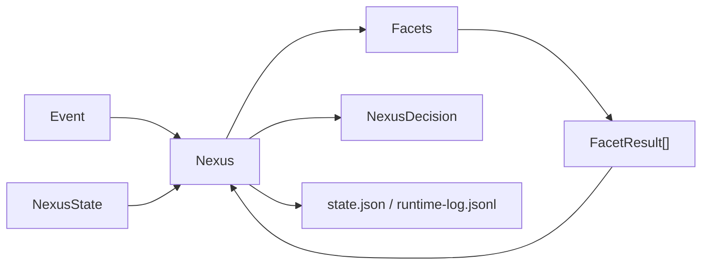

# Fullerene - architecture

This file gives shared names and intent from the product description so the harness stays consistent. It is not the only source of truth; keep it aligned with the implemented runtime as code lands.

## High-level shape

| Pillar | Meaning |
|--------|---------|
| State | Memory, goals, world model, and other structured runtime state |
| Control | Behavior, policy, and verification boundaries |
| Signal | Facets contribute observations, updates, and proposals |
| Execution | Planner and executor remain future components; v0 does not perform autonomous side effects |

## Facets (twelve)

Product vocabulary for modular components:

1. Memory
2. Affect
3. Attention
4. Context
5. World Model
6. Goals
7. Policy
8. Planner
9. Executor
10. Verifier
11. Behavior
12. Learning

Harness note: treat each as an interface-friendly boundary in design discussions. The current runtime implements `MemoryFacet`, `GoalsFacet`, `BehaviorFacet v0`, and `EchoFacet`; `BehaviorFacet v0` currently covers the first deterministic decision-policy role in the long-term twelve-facet model.

## Nexus loop (current v0)

- Accept an event plus the current runtime state.
- Pass the event and state through registered facets.
- Collect structured `FacetResult` objects.
- Integrate those results into a small `NexusDecision` (`WAIT`, `ASK`, `ACT`, `RECORD`), using explicit proposal priority `ACT > ASK > RECORD > WAIT` when multiple facets disagree.
- Persist the updated runtime snapshot plus an append-only event log.
- Avoid autonomous tool execution; `ACT` is only a typed decision for now.

## Data stores (current v0)

- **Local JSON files** - `state.json` snapshot plus `runtime-log.jsonl` under an explicit state directory.
- **SQLite memory store** - `memory.sqlite3` under the same state directory is the canonical store for what the system remembers.
- **SQLite goals store** - `goals.sqlite3` under the same state directory is the canonical store for explicit goals.

## Memory v0

- **Working memory** - derived from a bounded set of recent memory records; it is not a separate giant prompt file.
- **Episodic memory** - append-only records of observed events; this is the first real source-of-truth memory layer.
- **Semantic memory** - supported as a typed record in the schema, but v0 does not yet automate rich semantic extraction.
- **Retrieval** - deterministic only: keyword overlap, tag overlap, salience, and recency. No embeddings, vector DB, summarization, RAG, or model calls.
- **Inspection** - memory remains readable through SQLite rows and bounded facet metadata instead of opaque compressed blobs.

## Memory v1 (current)

- **Deterministic tag extraction** - `fullerene/memory/inference.py` declares a lowercase rule table for `communication`, `authority`, `urgent`, `hard-rule-candidate`, `bug`, `verification`, `memory`, `goals`, `policy`, and `correction`. Matching is case-insensitive with token boundaries, with smart-quote normalization so `don't` behaves the same whether the apostrophe is straight or curly.
- **Deterministic salience scoring** - base `0.3`, plus `+0.2` for user messages, `+0.2` for `hard-rule-candidate`, `+0.1` for `urgent`, `+0.2` for `correction`, `+0.1` for `authority`, and `+0.05` for `communication`. The total is clamped to `[0.0, 1.0]`. `explain_salience` returns the per-signal breakdown for inspection.
- **MemoryFacet integration** - on store, the facet infers tags from `event.content`, merges them with any explicit metadata-supplied tags (explicit tags retain priority), computes salience from the merged tag set, and persists `metadata_tags`, `inferred_tags`, and `salience_breakdown` alongside the canonical `MemoryRecord.tags` and `MemoryRecord.salience` fields.
- **Retrieval explanation** - `score_memory_record` still uses keyword 0.5, tag 0.2, salience 0.2, and recency 0.1, and `explain_score` exposes the per-component breakdown. Query-side tag overlap also uses deterministic content-inferred tags, so retrieval can benefit from tag matches even when the caller did not pass explicit metadata tags.
- **Out of scope** - no embeddings, no vector DB, no model calls, no RAG, no voice/prosody features.

## Memory roadmap

- **v1** - better deterministic scoring, tagging rules, and salience heuristics. **Current.**
- **v2** - embeddings / vector retrieval as a non-canonical index layered on top of SQLite.
- **v3** - memory links / graph structure, reflection or compression, and affect-weighted salience.

## Behavior v0 (current)

- **Deterministic and model-free** - `BehaviorFacet` does not call an LLM, planner, graph, executor, or external policy engine.
- **Current role in the 12-facet vision** - this is the first implemented deterministic decision-policy layer; it is intentionally narrow and inspectable.
- **Inputs** - event type/content, explicit event metadata, deterministic tag inference, deterministic salience, and any passed-through memory metadata when the caller provides it.
- **Outputs** - a proposed `WAIT` / `RECORD` / `ASK` / `ACT` decision plus inspectable metadata (`selected_decision`, `confidence`, `salience`, `tags_considered`, and `reasons`).
- **Inspectable confidence only** - `confidence` and `confidence_breakdown` are deterministic trace fields for inspection/debugging, not probabilistic ML confidence or model uncertainty.
- **Conservative policy** - empty/no-signal events wait; normal user messages record; response/uncertainty signals ask; explicit low-risk actions can propose `ACT`.
- **No execution** - `ACT` is only a typed proposal for a future executor; Nexus v0 still performs no autonomous tool execution or irreversible side effects.

## Goals v0 (current)

- **Explicit and persistent only** - goals are stored as inspectable records with `id`, `description`, `priority`, `status`, `tags`, timestamps, `source`, and `metadata`.
- **Canonical store** - `SQLiteGoalStore` persists goals in `goals.sqlite3`; SQLite is the source of truth.
- **Deterministic retrieval** - `GoalsFacet` loads active goals only and scores relevance from tag overlap, keyword overlap, and goal priority. No embeddings, vector DB, or model calls.
- **Behavior signal only** - goals do not execute actions or generate plans; they provide deterministic relevance signals that can raise `BehaviorFacet` confidence when the current event aligns with active goals.
- **Explicit creation only** - v0 supports explicit goal creation, including the CLI `create_goal` metadata hook. Automatic goal inference is not implemented.

## Model integration (current v0)

- None yet. Nexus is model-agnostic and does not call any provider in the first runtime slice.

## Conceptual diagram

## Verified mapping

| Component | Path / package | Notes |
|-----------|----------------|-------|
| Nexus | `fullerene/nexus/runtime.py` | `Nexus` / `NexusRuntime` event loop |
| Event and decision models | `fullerene/nexus/models.py` | Typed dataclasses for events, results, decisions, state, and records |
| Facet interface | `fullerene/facets/base.py` | `Facet` protocol |
| Example facet | `fullerene/facets/echo.py` | Small bundled facet for smoke/testing |
| Behavior facet | `fullerene/facets/behavior.py` | Deterministic, inspectable decision policy for `WAIT` / `RECORD` / `ASK` / `ACT` |
| Goals facet | `fullerene/facets/goals.py` | Deterministic active-goal lookup and relevance scoring; no planning or execution |
| Memory facet | `fullerene/facets/memory.py` | Deterministic episodic storage with v1 tag/salience inference plus bounded retrieval |
| Goals models and store | `fullerene/goals/` | `Goal`, `GoalStatus`, `GoalSource`, and SQLite-backed canonical goals store |
| Memory models and store | `fullerene/memory/` | `MemoryRecord`, scoring helpers, deterministic tag/salience inference (`inference.py`), and SQLite-backed canonical memory |
| State store | `fullerene/state/store.py` | In-memory or file-backed JSON persistence |
| CLI | `fullerene/cli.py`, `fullerene/__main__.py` | `python -m fullerene` |
