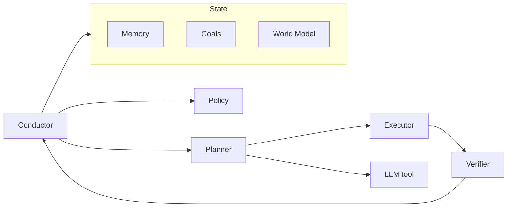

# Fullerene — architecture (harness vocabulary)

This file gives **shared names and intent** from the product description so the harness stays consistent. It is **not** a spec of implemented APIs or file layout. When code exists, add verified paths to the table at the end and keep narrative aligned with the repo.

## High-level shape

| Pillar | Meaning |
|--------|---------|
| State | Memory, goals, world model (structured, not raw chat logs) |
| Control | Policy (skills/rules), confidence, verification |
| Signal | Affect — intensity, urgency, confidence-like signals from text (voice later) |
| Execution | Planner → executor (skills sandboxed, permission-controlled) |

## Facets (twelve)

Product vocabulary for modular components:

1. Memory  
2. Affect  
3. Attention  
4. Context  
5. World Model  
6. Goals  
7. Policy  
8. Planner  
9. Executor  
10. Verifier  
11. Confidence  
12. Learning  

**Harness note:** Treat each as an interface-friendly boundary in design discussions; actual packaging and imports are **TBD** in code.

## Conductor loop (conceptual)

- Observe state and events.
- Build context (e.g. memory, attention, context facet).
- Decide next actions (policy, confidence).
- Invoke models and tools only when needed (planner / executor).
- Run verifier where required.
- Persist updates (memory, learning, goals, world model as applicable).

## Data stores (v0 intent)

- **SQLite** — durable state; document real schema in `ai/operations/database.md` when it exists.

## Model integration (v0 intent)

- **Ollama** — local inference; treat as a replaceable backend (model-agnostic goal).

## Conceptual diagram

## Verified mapping (fill when code exists)

| Component | Path / package | Notes |
|-------------|------------------|-------|
| Conductor | **TBD** | Main loop |
| SQLite access | **TBD** | Migrations, WAL, etc. |
| CLI | **TBD** | Operator entry |
