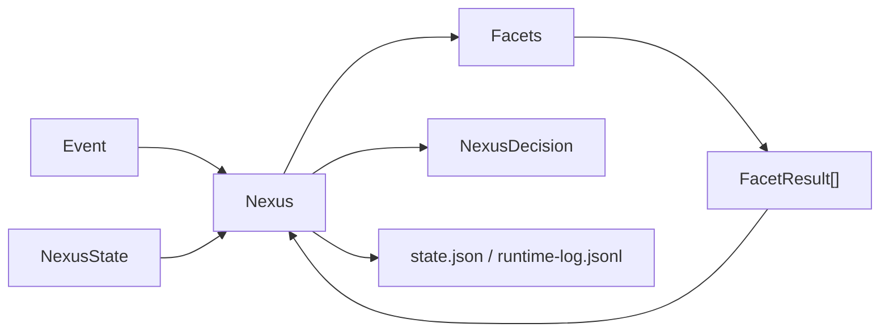

# Fullerene - architecture

This file gives shared names and intent from the product description so the harness stays consistent. It is not the only source of truth; keep it aligned with the implemented runtime as code lands.

## High-level shape

| Pillar | Meaning |
|--------|---------|
| State | Memory, goals, world model, and other structured runtime state |
| Control | Policy, confidence, and verification boundaries |
| Signal | Facets contribute observations, updates, and proposals |
| Execution | Planner and executor remain future components; v0 does not perform autonomous side effects |

## Facets (twelve)

Product vocabulary for modular components:

1. Memory
2. Affect
3. Attention
4. Context
5. World Model
6. Goals
7. Policy
8. Planner
9. Executor
10. Verifier
11. Confidence
12. Learning

Harness note: treat each as an interface-friendly boundary in design discussions. The first runtime slice only implements the facet contract plus a tiny example facet.

## Nexus loop (current v0)

- Accept an event plus the current runtime state.
- Pass the event and state through registered facets.
- Collect structured `FacetResult` objects.
- Integrate those results into a small `NexusDecision` (`WAIT`, `ASK`, `ACT`, `RECORD`).
- Persist the updated runtime snapshot plus an append-only event log.
- Avoid autonomous tool execution; `ACT` is only a typed decision for now.

## Data stores (current v0)

- **Local JSON files** - `state.json` snapshot plus `runtime-log.jsonl` under an explicit state directory.
- **SQLite** remains a future option once the runtime needs a richer schema.

## Model integration (current v0)

- None yet. Nexus is model-agnostic and does not call any provider in the first runtime slice.

## Conceptual diagram

## Verified mapping

| Component | Path / package | Notes |
|-----------|----------------|-------|
| Nexus | `fullerene/nexus/runtime.py` | `Nexus` / `NexusRuntime` event loop |
| Event and decision models | `fullerene/nexus/models.py` | Typed dataclasses for events, results, decisions, state, and records |
| Facet interface | `fullerene/facets/base.py` | `Facet` protocol |
| Example facet | `fullerene/facets/echo.py` | Small bundled facet for smoke/testing |
| State store | `fullerene/state/store.py` | In-memory or file-backed JSON persistence |
| CLI | `fullerene/cli.py`, `fullerene/__main__.py` | `python -m fullerene` |
