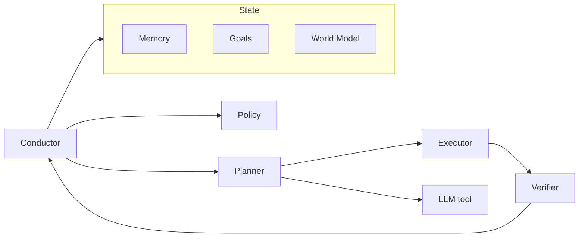

# Fullerene — architecture (harness-level)

This document tracks **intent** from the product description. Update with **verified** paths and types once code exists.

## High-level shape

- **State**: memory, goals, world model (structured, not raw chat logs).
- **Control**: policy (skills/rules), confidence, verification.
- **Signal**: affect (intensity, urgency, confidence-like signals from text; voice later).
- **Execution**: planner → executor (skills sandboxed, permission-controlled).

## Facets (12)

Core modules the runtime composes:

1. Memory  
2. Affect  
3. Attention  
4. Context  
5. World Model  
6. Goals  
7. Policy  
8. Planner  
9. Executor  
10. Verifier  
11. Confidence  
12. Learning  

Treat each as an **interface + implementation** boundary; avoid cyclic imports; prefer explicit messages/events between facets where possible.

## Conductor loop

Responsibilities (conceptual):

- Observe state/events.
- Build context (pull from Memory, Attention, Context facet).
- Decide next actions (Policy, Confidence).
- Invoke models/tools only when needed (Planner/Executor).
- Run Verifier where required.
- Persist updates (Memory, Learning, Goals, World Model as applicable).

## Data stores (v0)

- **SQLite**: durable state. Schema belongs in `operations/database.md` once defined.

## Model integration (v0)

- **Ollama**: local inference; treat as replaceable backend (model-agnostic goal).

## Diagram (conceptual)

## Fill-in table (after code exists)

| Component | Package/path | Notes |
|-----------|----------------|-------|
| Conductor | _TBD_ | main loop |
| SQLite access | _TBD_ | migrations, WAL |
| CLI | _TBD_ | user entry |
