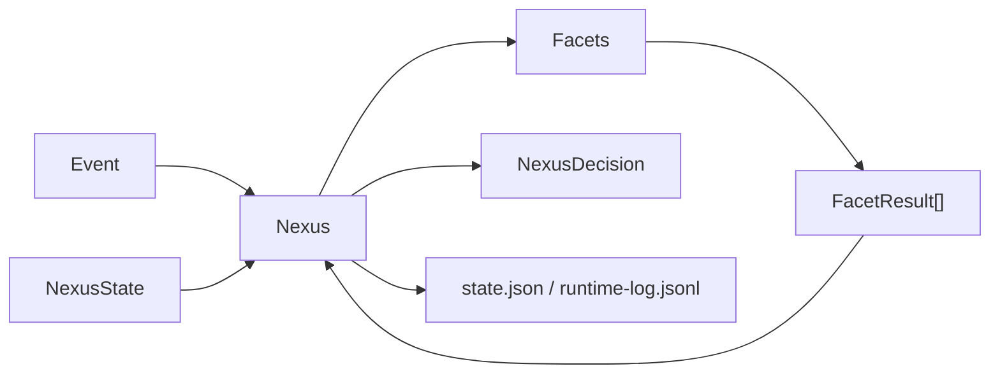

# Fullerene - architecture

This file gives shared names and intent from the product description so the harness stays consistent. It is not the only source of truth; keep it aligned with the implemented runtime as code lands.

## Behavior v2.2 modular architecture

- `fullerene/behavior/` now hosts deterministic Behavior v2.2 modules: `models.py`, `lexical.py`, `signals.py`, `scoring.py`, `confidence.py`, `trace.py`, and `learning.py`.
- `fullerene/facets/behavior.py` remains the public facet contract (`BehaviorFacet`, facet name `behavior`, `FacetResult` metadata) and preserves `WAIT/RECORD/ASK/ACT`.
- Lexical phrase heuristics remain isolated to `fullerene/behavior/lexical.py`; scoring consumes structured numeric signals and does not do raw phrase matching.

## Goals v1 (dynamic but explicit)

- Goals remain explicit persistent records in SQLite and continue to bias behavior/planning/context only.
- Goals v1 adds deterministic reinforcement from repeated high-salience related events, lifecycle transitions (`active`/`paused`/`completed`), completion evidence metadata, and bounded blocked/stale metadata.
- Paused and completed goals are retained for provenance but excluded from active ranking by default unless explicitly included.
- No hierarchy, decomposition, conflict-resolution engine, adaptive preference shaping, or autonomous execution was introduced in v1.

## High-level shape

| Pillar | Meaning |
|--------|---------|
| State | Memory, goals, world model, and other structured runtime state |
| Control | Behavior, policy, and verification boundaries |
| Signal | Facets contribute observations, updates, and proposals; Attention is the current spotlight selector for what should be foregrounded next |
| Execution | Planner v0 proposes inspectable plans; Executor v0 can execute approved internal-only actions with dry-run default and no external side effects |

## Facets (twelve)

Product vocabulary for modular components:

1. Memory
2. Affect
3. Attention
4. Context
5. World Model
6. Goals
7. Policy
8. Planner
9. Executor
10. Verifier
11. Behavior
12. Learning

Harness note: treat each as an interface-friendly boundary in design discussions. The current runtime implements `MemoryFacet`, `AffectFacet v0`, `AttentionFacet v1`, `GoalsFacet`, `WorldModelFacet`, `BehaviorFacet v0`, `PolicyFacet v0`, `PlannerFacet v0`, `ExecutorFacet v0`, `VerifierFacet v1`, `LearningFacet v1`, `ContextFacet`, and `EchoFacet`; `AffectFacet v0` covers deterministic internal VAD + novelty observation only, `AttentionFacet v1` covers deterministic fixed-weight focus scoring plus bounded broadcast/history/conflict metadata without cross-facet mutation, `BehaviorFacet v0` covers the first deterministic decision-selection role, `PolicyFacet v0` enforces deterministic permission boundaries, `PlannerFacet v0` proposes deterministic inspectable plans, `ExecutorFacet v0` performs approved internal-only execution with dry-run default, `VerifierFacet v0` runs deterministic post-decision inspection before persistence, and `LearningFacet v1` ingests explicit feedback plus Nexus/Behavior trace artifacts, routes deterministic cross-facet proposals, and applies bounded safe store updates through Memory/World Model public APIs only (no Learning-owned DB).

## Manual Tick Runner v0 (explicit SYSTEM_TICK only)

The **Manual Tick Runner** is a small CLI/runtime helper (`fullerene/tick/runner.py`, `--tick` / `--ticks` on `python -m fullerene`) that runs one or more **`EventType.SYSTEM_TICK`** cycles **on demand**. It is **not** an always-on daemon, **not** a background thread, **not** a scheduler or TUI/watch mode, **not** a continuous loop, and **not** spontaneous user-facing speech. Each outer call still uses **`NexusRuntime.process_event`**; ticks carry metadata such as `manual_tick`, `tick_index` / `tick_count`, optional `tick_reason`, and default **`suppress_expression: true`** so Expression Gate keeps user-facing expression off unless **`--allow-tick-expression`** is set (Gate may still emit recommendation metadata on the record). Multi-tick runs return a JSON-serializable **`TickRunResult`** (summaries, optional full records with `--json`/`--debug`, `final_state_summary`, conservative **stop conditions** such as consecutive extreme `system_pressure`, repeated verifier-critical signals, repeated `ask_user` expression rows, internal-event overflow, or runtime exceptions). **Continuous loop / watch v0** remains future work once manual tick behavior is validated.

## Watch Mode v0 (controlled repeated manual ticks + terminal snapshots)

**Watch Mode v0** is a terminal-facing CLI surface that runs **bounded, repeated manual** **`EventType.SYSTEM_TICK`** cycles using the existing Manual Tick Runner (`fullerene/tick/runner.py`), then renders compact **terminal snapshots** based on the tick summaries and Presentation Vector v0 data.

Watch Mode v0 is intentionally **not** a continuous loop v0 and is **not** an always-on daemon: it does not run as a background scheduler/thread, does not require a TUI framework rewrite, and does not generate autonomous user-facing prose. It honors the Manual Tick Runner stop conditions (pressure streaks, repeated verifier-critical signals, repeated expression `ask_user` with the same source, internal overflow, runtime exceptions) by stopping after the last completed tick and reporting the `stop_reason`.

In v0, the renderer is plain stdout text only; future work can add richer ASCII/animation renderers and/or continuous watch-loop behavior.

## Continuous Loop v0 (foreground bounded SYSTEM_TICK loop)

**Continuous Loop v0** is `fullerene/continuous/` plus CLI `--loop*` flags. It runs in the foreground only, executes one `SYSTEM_TICK` per interval, reuses existing tick/runtime/presentation/expression plumbing, and keeps display output minimal (`mode`, `pressure`, `text/status`). It is **not** a daemon, **not** a background service, **not** autonomous tool execution, **not** face/TUI rendering, and **not** infinite by default (bounded by `--loop-max-ticks`, default `100`).

Loop ticks keep state persistence across cycles through the normal `NexusRuntime.process_event` path. Expression Gate remains recommendation-only and suppresses user-facing output by default unless `--loop-allow-expression` is set. Even when expression is allowed, loop output is structured status only and does not invoke LLM prose generation or tools.

## Interactive Loop v0 (foreground conversational loop + SYSTEM_TICK)

**Interactive Loop v0** is `fullerene/interactive/` plus CLI `--interactive*` flags. It runs in the foreground only and alternates between bounded `SYSTEM_TICK` processing and line-oriented user input handling. User lines become normal `EventType.USER_MESSAGE` events processed through the standard `NexusRuntime.process_event` path (Context/Behavior/Policy/Verifier/Learning/Expression Gate are not bypassed).

Interactive Loop v0 is **not** a daemon/background service, **not** a full TUI, **not** autonomous tool execution, and **not** recursive self-talk. Input handling uses a minimal queue-based reader with one dedicated stdin thread only for collecting complete user lines; it never runs cognition or mutates runtime state directly.

Interactive v0 now defaults to **transcript mode** (no per-tick redraw): ticks continue internally but idle ticks stay silent unless configured. User interactions print `You:` and `Fullerene:` lines plus compact `[status]` summaries. `/status`, `/help`, and `/quit` are built-in line commands. Optional idle tick visibility is available through `--interactive-show-ticks` and `--interactive-status-every`.

By default, model text generation is disabled in interactive mode. `--interactive-allow-model` explicitly permits existing CLI model realization for **USER_MESSAGE** outputs only. `SYSTEM_TICK` events never call model adapters.

## Presentation Vector v0 (read-only UI projection)

**Presentation Vector v0** is **`fullerene/presentation/`** — a deterministic, JSON-serializable **read-only projection** of Nexus/cycle signals for future UIs or renderers. It is **not** one of the twelve canonical facets, **not** cognition, **not** emotion recognition, **not** an avatar renderer, **not** watch mode, **not** a background loop, and **must not** mutate `NexusState`, `NexusRecord` metadata, Memory, Policy, Behavior, Learning, Verifier, or any other runtime store. **`derive_presentation_vector(record, state=None)`** maps `NexusRecord` fields (including `signal_map`, Expression Gate recommendation, verifier rows, policy/learning/context/interrupt/LPB metadata, and optional `NexusState.facet_state` for attention/affect) onto `PresentationVector` with `mode`, `intensity`, `motion`, `channel`, renderer-neutral `face_state` / `eye_state` / `mouth_state` / `animation_hint`, and inspectable `reasons`. Priority and intensity rules are stable and documented in code. **Watch mode, live renderers, ASCII/TUI faces, and continuous presentation loops** remain future work; the CLI may surface compact lines via **`--presentation`** and embed `presentation_vector` in tick summaries when **`--presentation`** or **`--tick-summary`** is used with JSON output.

## Nexus loop (v1-lite + v2 bounded interrupts)

Nexus **v2** extends the same **single-call, event-driven** runtime with **bounded interrupt arbitration and suppression** only. It is **not** an always-on orchestrator, **not** autonomous speech generation, **not** a background daemon, **not** dynamic facet reordering, and **not** a chatbot loop. Nexus v2 collects **interrupt candidates** from cycle artifacts (Behavior v2, LPB, Verifier v1, Policy v1, Learning v1, Planner v1, Attention v1, and compact Nexus pressure/context signals), scores them deterministically, applies **cooldown / duplicate / low-priority / context-overload / policy ACT-denied / single-winner** suppression rules (see `fullerene/nexus/interrupts.py`), and may queue **at most one** additional **internal** event per outer `process_event` with `content="nexus_interrupt"` and compact JSON-safe metadata—**never** LLM/tool/network calls. **Interrupt `SuppressionDecision.allowed_user_expression` remains false** (Nexus v2 does not authorize outward speech from interrupt rows). **Expression Gate v0** (`fullerene/expression/`) runs after interrupts/LPB and outputs a separate **recommendation only** (mode, score, intent, bounded payload); it does not generate prose, call models, or print to the user—downstream surfaces decide what to do later.

### Nexus v1 mechanics (unchanged core)

- Accept an event plus the current runtime state.
- Build a canonical per-cycle `signal_map` (`CycleSignalMap`) so cross-facet signals are normalized and inspectable in one place.
- Aggregate bounded canonical `system_pressure` from explicit components and persist both `system_pressure` and `pressure_components` on Nexus state/records:
  - `event_pressure`
  - `attention_pressure`
  - `latent_pressure`
  - `contradiction_pressure` (`0.15` when contradiction is true)
  - `context_overload_pressure` (`0.1` when context is overloaded)
  - `interrupt_pressure` (`0.1` when interrupt is recommended)
- Pass the event and state through registered facets in deterministic phases: INPUT / CONTEXT, STATE, DECISION, PLANNING / EXECUTION, LEARNING / SIGNAL, and VERIFICATION / OUTPUT.
- Preserve registered order within phases except for small pressure-priority weights in the decision, planning/execution, and learning/signal phases; no arbitrary reordering or phase skipping is implemented.
- When enabled, Attention runs after the signal-producing facets already registered for the current run, scores candidate focus items from the current event plus available memory / goals / world-model / execution metadata, classifies bottom-up vs top-down mode, and stores a bounded broadcast/history/conflict packet on attention facet state.
- Collect structured `FacetResult` objects.
- Integrate those results into a small initial `NexusDecision` (`WAIT`, `ASK`, `ACT`, `RECORD`), using explicit proposal priority `ACT > ASK > RECORD > WAIT` when multiple facets disagree.
- Apply policy guardrails before finalizing the initial action: policy `DENIED` results force `RECORD`, and policy `APPROVAL_REQUIRED` results force `ASK`, even if another facet proposed `ACT`.
- Run deterministic verifier checks against the event, facet results, initial decision, and configured state-dir metadata. Unsafe or structurally invalid `ACT` decisions may be downgraded to `ASK` or `RECORD` before persistence.
- Persist the updated runtime snapshot plus an append-only event log, including verifier metadata as a `FacetResult` and compact phase/pressure trace metadata on each `NexusRecord`.
- Collect facet-emitted `learning_event` metadata into per-cycle `cycle_learning_events`; Nexus exposes them to Learning through `facet_state['nexus']['current_cycle_learning_events']` during the learning_signal phase (and persists `last_learning_events` after the cycle).
- Nexus v2 may queue one minimal internal event (`nexus_interrupt`) when a scored interrupt candidate survives suppression; **explicit facet-emitted `internal_events` still take priority** over Nexus v2 candidates. At most one additional `internal` event is processed immediately after the current outer event; no recursive same-call internal-event expansion is allowed. LPB **ignition** becomes an interrupt **candidate**, not autonomous speech or execution.
- Persist compact `cycle_trace` metadata each cycle (decisions, pressure before/after, pressure components, signal map, learning events, queued/processed internal events, verifier adjustments, Nexus v2 `interrupt_candidates` / `suppression_decisions` / `allowed_interrupt_candidate` / `suppressed_interrupts` / compact `interrupt_cooldowns` / `interrupt_queue_size` / `interrupt_processed` / `suppression_summary`, Expression Gate `expression_recommendation` / scores / budget summaries, and source facets). Expression recommendation and `ExpressionBudgetState` also persist under `facet_state["nexus"]["expression_gate"]` (support infrastructure, **not** one of the twelve canonical facets).
- Avoid autonomous external tool execution; `ACT` is still only a typed decision, and Executor v0 only records or applies approved internal state actions.
- Scope guardrail: this deeper pass is still **single-cycle orchestration only**; it is not an always-on daemon loop, sleep/wake system, dynamic suppression engine, or autonomous expression system.
- Latent Pressure Buffer (LPB) v1.1 runs as **signal infrastructure** under `fullerene/signals/latent_pressure/` (not a canonical facet). Nexus calls LPB after facet results are available, persists LPB state under `facet_state["signals"]["latent_pressure"]`, exposes LPB metadata on records (`latent_pressure`, `latent_pressure_result`, top entries, ignition recommendation), and feeds `latent_pressure_total` into pressure aggregation. On idle/internal `SYSTEM_TICK` cycles LPB now prefers decay over ingestion: routine echo signals are gated/suppressed, LPB/Nexus interrupt self-feedback is filtered, inactive entries decay faster, repeated same-key reactivation is dampened, and tick-time total-pressure ignition is gated so latent-only idle totals do not keep retriggering interruption without new/critical signal.

## Data stores (current v0)

- **Repository state** - Process-local files (default CLI `--state-dir`, unit test DBs, manual smoke directories) live under gitignored `state/` at the repo root; use `fullerene.workspace_state` instead of creating new dot-directories beside the project. World model test DBs go under `state/world_model_storage/`, parallel to `mem_storage/` and `goals_storage/`.
- **Local JSON files** - `state.json` snapshot plus `runtime-log.jsonl` under an explicit state directory.
- **SQLite memory store** - `memory.sqlite3` under the same state directory is the canonical store for what the system remembers.
- **SQLite goals store** - `goals.sqlite3` under the same state directory is the canonical store for explicit goals.
- **SQLite world model store** - `world.sqlite3` under the same state directory is the canonical store for explicit beliefs about reality.
- **SQLite policy store** - `policy.sqlite3` under the same state directory is the canonical store for explicit user/system policy rules.

## Memory v0

- **Working memory** - derived from a bounded set of recent memory records; it is not a separate giant prompt file.
- **Episodic memory** - append-only records of observed events; this is the first real source-of-truth memory layer.
- **Semantic memory** - supported as a typed record in the schema, but v0 does not yet automate rich semantic extraction.
- **Retrieval** - deterministic only: keyword overlap, tag overlap, salience, and recency. No embeddings, vector DB, summarization, RAG, or model calls.
- **Inspection** - memory remains readable through SQLite rows and bounded facet metadata instead of opaque compressed blobs.

## Memory v1

- **Deterministic tag extraction** - `fullerene/memory/inference.py` declares a lowercase rule table for `communication`, `authority`, `urgent`, `hard-rule-candidate`, `bug`, `verification`, `memory`, `goals`, `policy`, and `correction`. Matching is case-insensitive with token boundaries, with smart-quote normalization so `don't` behaves the same whether the apostrophe is straight or curly.
- **Deterministic salience scoring** - base `0.3`, plus `+0.2` for user messages, `+0.2` for `hard-rule-candidate`, `+0.1` for `urgent`, `+0.2` for `correction`, `+0.1` for `authority`, and `+0.05` for `communication`. The total is clamped to `[0.0, 1.0]`. `explain_salience` returns the per-signal breakdown for inspection.
- **MemoryFacet integration** - on store, the facet infers tags from `event.content`, merges them with any explicit metadata-supplied tags (explicit tags retain priority), computes salience from the merged tag set, and persists `metadata_tags`, `inferred_tags`, and `salience_breakdown` alongside the canonical `MemoryRecord.tags` and `MemoryRecord.salience` fields.
- **Retrieval explanation** - `score_memory_record` still uses keyword 0.5, tag 0.2, salience 0.2, and recency 0.1, and `explain_score` exposes the per-component breakdown. Query-side tag overlap also uses deterministic content-inferred tags, so retrieval can benefit from tag matches even when the caller did not pass explicit metadata tags.
- **Out of scope (v1)** - no embeddings, no vector DB, no model calls, no RAG, no voice/prosody features.

## Memory v2 (current)

- **SQLite remains the source of truth** - `memory.sqlite3` still stores canonical episodic memory rows. Memory v2 only *adds*: it does not move authority off SQLite. Embeddings, edges, and hybrid scoring are inspectable indexes over those rows and can be missing or stale without breaking retrieval.
- **Role-aware classification at write time** - `fullerene/memory/roles.py` adds a small deterministic classifier for `preference`, `fact`, `question`, `task`, `feedback`, `outcome`, and `unknown` roles. Phrases like `I like ...`, `What ...?`, `I need to ...`, `that worked`, and `the deploy succeeded` map to the matching role. Roles are persisted on `MemoryRecord.role` and on a new `role` column in the `memories` table.
- **Domain inference** - `fullerene/memory/inference.py` adds a deterministic `infer_domain` helper plus tag rules for reading/books, outdoors/water, project/software, and task/work. Each new memory carries a deterministic `domain` (for example, `reading_books`) on a new `domain` column. Domains are coarse buckets, not hardcoded per-topic special cases.
- **Optional embedding index** - `fullerene/memory/embeddings.py` defines an `EmbeddingProvider` protocol plus two concrete providers: `DeterministicHashEmbeddingProvider` (offline-safe, used by tests and as the default fallback) and `OllamaEmbeddingProvider` (opt-in `POST /api/embeddings` client). Vectors are stored in a separate `memory_embeddings` table keyed by `(memory_id, model)` so SQLite stays the source of truth. Missing or failing providers always degrade to deterministic v1 retrieval.
- **Hybrid retrieval scoring** - `fullerene/memory/hybrid.py` defines the v2 retrieval score as `0.35 * semantic + 0.20 * tag + 0.15 * salience + 0.10 * recency + 0.10 * domain_match + 0.10 * role_bonus - role_penalty`. Role bonuses prefer preference memories for recommendation queries, task memories for planning queries, and fact memories for factual queries. Role penalties demote prior question memories for recommendation queries and old/duplicate questions in general. `explain_hybrid_score` returns the full per-component breakdown for inspection.
- **Bounded write-time edges** - `fullerene/memory/edges.py` plus `MemoryFacet` write inspectable edges into a new `memory_edges` table when a memory is stored. Candidate sets are bounded to recent (≤20) + high-salience (≤20) + same-domain (≤20) memories; no full graph traversal happens. Edge types include `same_goal`, `tag_overlap`, `temporal_proximity`, `keyword_similarity`, `semantic_similarity`, `same_domain`, and `role_related`. Memory v2 only writes edges; retrieval does not yet traverse them.
- **Context integration** - `DynamicContextAssembler` and `ContextFacet` use hybrid retrieval when the store supports it, surface `retrieval_strategy`, `query_intent`, `event_domain`, `included_memory_roles`, `included_memory_domains`, and `memory_score_breakdowns` in context metadata, and attach role/domain to each memory `ContextItem`.
- **Prompt grounding** - the CLI model prompt builder annotates relevant/recent memories with `role=...` and `domain=...` so model prompts no longer dump JSON or repeat prior questions as primary grounding.
- **Out of scope (v2)** - no LLM summarization, no graph traversal at retrieval time, no Leiden/community detection, no learned weights, no required external services. The `OllamaEmbeddingProvider` exists but is opt-in only.

## Memory v2.5 (working memory / conversation continuity)

- **Same Memory subsystem, new layer field** - `MemoryRecord` now carries `memory_layer` (`working` or `long_term`), with additive SQLite migration defaulting legacy rows to `long_term`.
- **Session-scoped working memory turns** - `SQLiteMemoryStore` supports bounded `add_working_turn`, `list_working_turns(session_id, limit)`, and `prune_working_memory(session_id, keep_last)` helpers that store exact dialogue turns (`dialogue_role`, `turn_index`, `session_id`) without embedding/hybrid retrieval.
- **Strict boundary from long-term retrieval** - working-memory rows are excluded from Memory v2 long-term/hybrid retrieval paths unless working helpers are explicitly used.
- **Interactive loop continuity** - interactive runs now carry one stable `session_id` and write exact user + assistant visible turns into working memory; tick-only cycles do not create assistant dialogue turns.
- **Context v2-lite behavior** - dynamic context now includes a bounded `working_memory` packet (`recent_working_memory`) before generic long-term memory items when `session_id` is present.
- **Prompt grounding** - model prompts include a `Recent conversation` section built from the bounded working-memory packet.
- **Out of scope (v2.5)** - no new facet/subsystem, no LLM summarization/compression, no automatic working→long-term promotion, no graph/community/Leiden pass.

## Memory v3 (current)

- **Linked graph (bounded)** - Memory v3 treats `memory_edges` as a bounded, write-time graph plus persisted **memory communities** (thematic concern / clusters) in SQLite (`memory_communities`, `memory_community_members`, optional `memories.community_id`). Helpers expose direct neighbors and community listing with strict limits; retrieval does **not** perform full-graph walks.
- **Community detection** - default strategy is `deterministic_connected_components_v0` (deterministic, thresholded connected components; optional split of oversized components). A **Leiden** seam exists (`LeidenCommunityDetector`) but is not enabled without an optional backend.
- **Activation and pressure** - community-level `activation_score` / `pressure_score` feed Context (prior-cycle snapshot), bounded hybrid v3 retrieval bonuses, and LPB signals (`memory_cluster_activation`) on non-idle ticks only (idle `SYSTEM_TICK` suppresses ingestion).
- **Contradiction / refinement** - tracked via memory `metadata` (`contradiction_status`, links, scores) and aggregated counts on communities; optional deterministic content heuristics in `fullerene.memory.contradiction`.
- **Affect / salience v3** - prior-cycle Affect state plus event pressure/novelty optionally adjust stored salience (`salience_version: v3`, bounded deltas).
- **Compression** - optional non-canonical fields live in memory `metadata` (`compressed_summary`, `compression_is_canonical: false`); episodic rows remain source of truth.
- **Out of scope for this pass** - LLM summarization, model training, mandatory heavy graph libraries, unbounded traversal, replacing World Model belief logic.

## Memory roadmap

- **v1** - deterministic scoring, tagging rules, and salience heuristics.
- **v2** - role/domain classification, optional embedding index, hybrid retrieval, and bounded write-time edges.
- **v2.5** - working/long-term split and session working turns.
- **v3** - memory communities, bounded graph helpers, activation/pressure, hybrid v3 bonuses, LPB hooks, contradiction/affect/compression seams. **Current.**
- **v4+** - future optional Leiden backend, richer reflection/compression pipelines (still non-authoritative over episodic SQLite).

## Affect v0 (current)

- **Internal state only** - `fullerene/affect/` plus `AffectFacet` derive Fullerene's own affective state vector from its runtime signals. Affect v0 is not emotion recognition, not sentiment analysis, and not a chatbot personality layer.
- **Current state shape** - Affect v0 emits inspectable `AffectState` and `AffectResult` payloads with `valence` in `[-1.0, 1.0]`, `arousal` / `dominance` / `novelty` in `[0.0, 1.0]`, component breakdowns, reasons, and metadata.
- **Signal sources** - valence comes from deterministic goal / feedback / execution success-or-failure signals; arousal comes from pressure, urgency, salience, and attention peaks when available; dominance comes from executor-control and world-confidence signals; novelty comes from explicit metadata or inverse memory hit rate when memory retrieval state is available.
- **Observation only** - Affect v0 records state each cycle and may keep a short bounded history in Nexus facet state, but it does not change Memory, Goals, World Model, Attention, Context, Behavior, Policy, Planner, or Executor behavior.
- **No learned inference** - no LLM calls, embeddings, prosody, user-emotion detection, or sentiment model are involved.

## Affect roadmap

- **v0** - deterministic internal VAD + novelty derivation, bounded inspectable history, observation only. **Current.**
- **v1** - salience modulation, expression-threshold modulation, affect-tagged memories, and affect trajectory contributing to pressure. **Future.**
- **v2** - deterministic appraisal layer (`goal relevance`, `goal congruence`, `agency`, `coping potential`), expression-character influence, and a possible small local regression model later. **Future.**
- **v3** - goal-priority influence, memory-decay influence, attention-competition influence, system-health signaling, and cross-facet affect broadcast. **Future.**

## Attention v1 (current)

- **Deterministic spotlight plus broadcast** - `fullerene/attention/` plus `AttentionFacet` implement a fixed-weight competition that scores what should receive focus right now, classifies candidates as bottom-up vs top-down, and broadcasts the winning item as inspectable metadata/state. No LLM calls, embeddings, graph reasoning, RAG, or learned weights are involved.
- **Inspectable output** - Attention emits inspectable `AttentionItem`, `AttentionBroadcast`, `AttentionConflict`, `AttentionHistoryEntry`, and `AttentionResult` payloads with weighted component breakdowns, per-candidate scores, dominant components, top-N focus items, winner broadcast metadata, conflict signals, and bounded winner history. The default `top_n` is `3`.
- **Current inputs** - the current event always becomes an attention candidate; relevant memories come from the optional memory store; relevant goals, beliefs, and execution outcomes are read from already-produced facet state when those facets are enabled earlier in the same run.
- **Conservative broadcast only** - Attention v1 stores `last_attention_broadcast`, `last_attention_broadcast_item_id`, `last_attention_mode`, `last_attention_conflict`, and bounded `attention_history` on attention facet state. Context may expose the broadcast as an `attention` context item, but Attention still does not mutate Memory, Goals, World Model, Policy, Planner, or Executor stores, trigger another Nexus cycle, or change facet order.
- **Conflict and repetition signals** - when the top two scores are within `0.05`, Attention emits an `AttentionConflict`; repeated recent winners add a small inspectable `pressure_contribution` field to the broadcast without redesigning global pressure aggregation.
- **Global Workspace inspiration** - conceptually, Nexus is the director and Attention is the spotlight in a global-workspace-style loop. The current implementation now includes spotlight selection plus a bounded broadcast packet, while ignition/refractory mechanics remain future work.

### Attention scoring formula

```
score = (
    memory_salience     * 0.25 +
    goal_priority       * 0.25 +
    pressure            * 0.20 +
    novelty             * 0.15 +
    belief_uncertainty  * 0.10 +
    execution_recency   * 0.05
)
```

- Missing signals are treated as `0.0`.
- Scores are clamped to `[0.0, 1.0]`.
- `pressure` comes from `event.metadata["pressure"]` when present.
- `novelty` comes from `event.metadata["novelty"]` when present, else a weak deterministic heuristic.

### Attention roadmap

- **v0** - deterministic fixed-weight scoring, top-N focus items, metadata only, no broadcast. **Implemented as the base scorer.**
- **v1** - broadcast to facets, bottom-up vs top-down competition, conflict detection, and attention history. **Current.**
- **v2** - ignition threshold, refractory period, cluster attention, and pressure modification. **Future.**
- **v3** - learned weights, predictive attention, meta-attention, and an optional local classifier. **Future.**

### Theater model metaphor

- **Stage** = Context
- **Spotlight** = Attention
- **Audience** = facets
- **Director** = Nexus
- **Script** = Goals
- **Improvisation** = bottom-up salience and novelty

## Context v1/v2 (current)

- **Deterministic working packet** - `ContextFacet` now assembles a bounded inspectable `ContextWindow` from active runtime state at the start of the Nexus cycle, rather than exposing only a static recent-memory slice.
- **Current sources** - the current event is always included directly, followed by an optional attention-broadcast context item, bounded active goals, relevant memories, recent episodic memories, active beliefs, a compact policy summary, and optional compact planner / executor / attention / affect / learning summaries when those signals are available.
- **Deterministic scoping** - bounds come from `ContextAssemblyConfig` (`max_goals`, `max_memories`, `max_beliefs`, `salience_threshold`, `include_policy_summary`, `include_signal_summaries`). Context v1 deduplicates repeated memories, deduplicates active goals by deterministic normalized description before exposure, preserves `source_id`, and does not load whole stores without limits.
- **Strategy support** - `ContextFacet` supports `static_recent_episodic_v0`, `dynamic_active_facets_v1`, and `pressure_relevance_v2`; the dynamic strategy remains the conservative default when context is enabled through current CLI/runtime wiring.
- **Goal hygiene** - goal-intent creation now normalizes descriptions (case, punctuation, spacing, and common intent prefixes) and merges exact normalized duplicates into an existing active goal instead of creating a second row. Context also shields reused state directories by deduplicating already-persisted active goals before prompt grounding.
- **Prompt grounding** - the CLI model prompt builder now renders a concise "Current working context" section from the assembled window so active goals, memories, beliefs, policy constraints, and the current event are visible to later response generation without dumping raw JSON.
- **Read-only role** - Context v1 still does not plan, summarize with an LLM, mutate stores, use embeddings, use RAG, perform graph traversal, or compress context. It is a deterministic assembly layer only.

## Context v1.5-lite (working-memory inclusion)

- **Bounded recent dialogue inclusion** - when `event.metadata.session_id` is present, context includes a bounded chronological `working_memory` section sourced from Memory v2.5 working turns.
- **Session isolation** - only turns for the current session id are included.
- **Inspectable metadata** - context metadata now surfaces `working_memory_session_id`, `working_memory_turn_count`, and `included_working_memory_turns`.

## Context v2 (pressure/relevance-filtered deterministic assembly)

- **Deterministic selection and bounded budget** - Context v2 adds deterministic candidate scoring (`relevance`, `pressure`, `salience`, `recency`, `confidence`, `priority`) plus bounded budget selection with protected inclusions. It is not LLM summarization, not graph traversal, and not a Nexus rewrite.
- **Protected continuity first** - current event and same-session recent working-memory turns are protected inclusions before scored candidates so immediate conversational continuity is preserved.
- **LPB/attention aware** - Context v2 can pull compact high-pressure unresolved LPB entries and the current attention broadcast/winner into context when relevant, without dumping raw subsystem state.
- **Hybrid long-term memory only** - long-term memory candidates use Memory v2 hybrid retrieval with score breakdowns; working-layer rows remain excluded from long-term retrieval paths.
- **Traceability and decay metadata** - Context v2 surfaces included/excluded item IDs, score breakdowns, budget usage, stale/evicted counts, and compact exclusion reasons for inspectability.
- **Out of scope (still)** - not Memory v3, not Leiden/community clustering, not retrieval-time graph traversal, not automatic memory promotion, not a new facet.

## Context v2.1 (working-memory reference anchors)

- **Deterministic continuity extraction** - Context now derives compact `ConversationContinuity` metadata from bounded same-session working-memory turns (no LLM calls, no summarization).
- **Reference anchors** - referential tokens in the current user message (for example `one`, `it`, `that`, `this`, `they`, `there`) are mapped to conservative recent noun-like candidates with confidence and reasons in JSON-safe `reference_anchors`.
- **Topic hints** - Context derives short `topic_terms` plus `current_topic_hint` from repeated recent noun-like terms across user/assistant turns.
- **Unresolved references** - when referential tokens are present but no plausible candidate exists, Context emits `unresolved_references` for targeted clarification behavior downstream.
- **Integration surface** - continuity metadata is exposed on `ContextWindow.metadata`, `ContextFacet` metadata/state updates, and prompt grounding (`Conversation continuity` section when useful). Behavior can consume the stable fields without a Behavior-side architecture change.
- **Scope guardrails** - no new facet, no Dialogue subsystem, no Memory v3 graph work, no prompt-specific hardcoding, no model-assisted extraction.

## Context roadmap

- **v0** - static working memory window from recent episodic records only. **Implemented for explicit compatibility.**
- **v1** - dynamically assembled bounded working packet from current event, active goals, recent/relevant memories, active beliefs, policy summary, and compact signal summaries under deterministic scoping rules. **Current.**
- **v2** - pressure/relevance-filtered deterministic assembly with protected working-memory continuity and LPB/attention-aware inclusion. **Current.**
- **v3** - self-editing context, semantic consolidation, predictive loading, and pressure signaling when the context window overloads. **Future.**

## Behavior v2.3 (current)

- **Deterministic and model-free** - `BehaviorFacet` does not call an LLM and does not generate final prose; it routes decisions only.
- **Reference-continuity consumption** - Behavior v2.3 consumes Context v2.1 continuity fields (`reference_anchors`, `reference_anchor_count`, `unresolved_references`, `continuity_confidence`, `current_topic_hint`, `topic_terms`) with neutral defaults when fields are absent.
- **Conversational intent routing** - Behavior classifies inspectable conversational intents (for example follow-up, source request, challenge/correction, planning/action/memory update) and now treats short referential turns with resolved anchors as `follow_up` without generic ambiguity inflation.
- **Grounding and ambiguity signals** - Behavior computes `reference_resolution_confidence`, `has_resolved_reference`, `has_unresolved_reference`, and `unresolved_reference_count`; resolved references lower ambiguity and unresolved references set `ambiguity_kind = unresolved_reference` with targeted ASK pressure.
- **Confidence decomposition** - `confidence` remains deterministic and inspectable, with additive reference continuity terms (`reference_resolution_contribution`, `unresolved_reference_penalty`) while preserving Behavior trace compatibility for Verifier checks.
- **Learning-event metadata** - Behavior emits generic continuity learning flags (`resolved_reference_follow_up`, `unresolved_reference`, `continuity_supported_decision`) plus existing intent/grounding/ambiguity/confidence metadata.
- **Safety compatibility** - Policy/Verifier constraints are still enforced (`denied` suppresses `ACT`, `approval_required` biases `ASK`), and world-model contradiction/low-confidence/context-overload guardrails still override reference boosts.
- **No execution** - `ACT` is only a typed proposal for a future executor; Nexus v0 still performs no autonomous tool execution or irreversible side effects.

## Learning v1 (current)

- **Deterministic cross-facet feedback router** - `fullerene/learning/` plus `LearningFacet` still own no canonical store. Learning reads Nexus `CycleSignalMap` previews, per-cycle `cycle_learning_events`, `BehaviorFacet` `behavior_decision_trace_v2`, Context/Memory co-retrieval ids, and explicit metadata; it emits JSON-serializable `LearningResult.metadata` (`learning_version`, `consumed_learning_events`, `signal_sources`, adjustment lists, `cross_facet_routes`, `reasons`).
- **Store boundaries** - Memory graph weight updates go through `SQLiteMemoryStore.strengthen_memory_edge`; belief confidence through `SQLiteWorldModelStore.update_belief_confidence` or full `update_belief`; salience/goal paths keep Learning v0 EMA rules. Behavior threshold changes remain **proposal-only** (routes/metadata). No policy/executor permission mutation, no LLM calls, no background threads, no unbounded graph traversal (only co-retrieval pairs visible in facet state).
- **Hebbian co-retrieval** - When two or more memories appear in the same bounded co-retrieval set, Learning applies a small bounded edge weight increment (`keyword_similarity` edge type) using `learning_rate * activation_a * activation_b` with activations from hybrid/total score, salience, or neutral `0.5`.
- **World model** - Contradiction/corroboration adjusts confidence conservatively (default `0.05`, strong dual-source `0.10`) with provenance on belief metadata; contradicted beliefs may be flagged `CONTRADICTED` without deletion.
- **Salience validation** - High-salience memories not in the current co-retrieval window and without explicit linkage metadata may receive salience downweight **proposals**; success signals with co-retrieval may apply minor salience upweights when `update_memory_salience` is available.
- **v0 compatibility** - Explicit user feedback, executor outcomes, and goal lifecycle signals use the same conservative v0 classifiers and minor nudges; v1 layers additional records alongside them.

## Learning roadmap

- **v0** - explicit feedback only; minor nudges; proposal-only when unsure. **Superseded by v1 for the integrated runtime; rules retained inside v1.**
- **v1** - deterministic cross-facet routing, bounded Hebbian edge updates, conservative belief confidence edits, salience decay checks, inspectable routes. **Current.**
- **v2** - temporal-difference credit assignment, cluster-level learning, skill track records, and an execution pattern library. **Future.**
- **v3** - meta-learning, behavioral policy refinement, expression outcome tracking, contradiction-driven belief restructuring, and an optional small trained model for signal classification. **Future.**

## Stove Rule

- **v0** - Bob touches the stove, you tell him it was hot, and he notes it down carefully.
- **v1** - Bob touches the stove, it fails, and he associates that cluster with failure signals.
- **v2** - Bob traces back through everything that led to touching the stove.
- **v3** - Bob generalizes that stoves are bad and updates the world model with support.

## Planner v0 (current)

- **Deterministic and model-free** - `fullerene/planner/` plus `PlannerFacet` do not call an LLM, embedding system, graph engine, executor, or external tool.
- **Trigger scope only** - Planner v0 runs only for explicit plan requests (`request_plan` or simple planning phrases) or when a high-priority active goal is present and the current event explicitly asks for next steps.
- **Inputs** - active goals from the optional goals store, active beliefs from the optional world-model store, policy constraints when a policy store is available, and a simple pressure signal taken from `event.metadata["pressure"]`, then `event.metadata["salience"]`, then current behavior confidence, else `0.0`.
- **Outputs** - a proposed `Plan` with ordered `PlanStep` rows, inspectable `confidence`, `pressure`, `reasons`, and step-level `risk_level` / `requires_approval` / `policy_status` metadata.
- **Pressure behavior** - pressure >= `0.7` yields a shorter, more direct 2-step plan and lowers the proposal threshold slightly; lower pressure yields up to 3 clarifying or exploratory steps.
- **Policy filtering** - Planner v0 can evaluate steps through the existing policy logic when a policy store is configured; denied steps are marked `blocked`, approval-gated steps are marked `requires_approval`, and high-risk steps require approval even without an explicit policy match.
- **Verifier visibility** - Planner does not approve or execute anything. It marks risk and approval requirements so verifier checks and future executor work can inspect them later.
- **No execution or tool calls** - Planner v0 never emits tool execution, shell/network/git use, or autonomous side effects.

## Planner roadmap

- **v0** - deterministic, no LLM, explicit-request or high-priority-goal trigger, policy-filtered inspectable `Plan` / `PlanStep` output, no execution. **Current.**
- **v1** - context-aware planning, multi-goal planning, and plan memory. **Future.**
- **v2** - LLM-assisted step generation, hierarchical plans, and world-model uncertainty signals that can require approval. **Future.**
- **v3** - predictive planning, plan evaluation loops, and adversarial checking. **Future.**

## Executor v1 (current)

- **Manifest-backed skill registry** - `fullerene/executor/registry.py` and `fullerene/executor/skills.py` register built-ins and any external skills explicitly; unknown skills are refused (`skill_not_registered`) and no dynamic loading is allowed.
- **Sandboxed file skills** - Executor v1 adds `file_read`, `file_write`, and `file_list` through `fullerene/executor/file_ops.py` with strict sandbox resolution (`fullerene/executor/sandbox.py`) under `<state-dir>/sandbox` by default.
- **Internal actions remain constrained** - v0-compatible internal updates still run through explicit registered skills (`memory_write`, `goal_update`, `internal_event`, `world_model_belief_update`) with no shell/network/git/MCP execution.
- **Dry-run default** - execution happens only when `event.metadata["execute_plan"]` is true, and it stays in dry-run mode unless `event.metadata["dry_run"] == false`.
- **Approval gate + timeout** - approval-required steps yield `pending_approval` until explicit approval metadata arrives; after bounded cycles they become `approval_timeout` and are skipped.
- **No partial execution** - all steps preflight first; any preflight failure blocks live execution for the whole plan; runtime failure halts and marks remaining steps `skipped_due_to_prior_failure`.
- **Every action logged** - execution records include skill/action/target/version/policy/approval/sandbox metadata and file operations have a separate bounded audit log.
- **Live mode does not broaden permissions** - `--live` only enables already-supported internal mutations for an explicitly requested plan. It does not bypass approval, policy, or risk checks, and it does not unlock shell, network, git, or arbitrary file access.
- **No external side effects** - no shell, network, git, dynamic plugin loading, MCP connectors, parallel execution, or rollback automation.

## Executor roadmap

- **v0** - internal actions only; no shell, network, git, or external file writes; dry-run default; every action logged; no partial execution; refuses unapproved, blocked, or unsupported actions.
- **v1** - sandboxed file operations, manifest-backed skill registry, approval gate, and planner feedback metadata. **Current.**
- **v2** - constrained network/git read access, parallel step execution, resource monitoring, and rollback support. **Future.**
- **v3** - full skill ecosystem, execution learning, adaptive approval thresholds, and execution identity plus audit trail. **Future.**

## Helmet Rule

- **v0** - Fullerene can update its own state.
- **v1** - Fullerene can touch files and invoke skills.
- **v2** - Fullerene can read the network and git.
- **v3** - Fullerene can act in the world.
- **Trust is not given. It is accumulated.**

## Policy v1 (current)

- **Deterministic constraint layer** - `PolicyFacet` is model-free and does not plan, infer rules, execute tools, or use fuzzy judgment. It evaluates modeled actions (and plan steps) against explicit rules plus built-in sandbox defaults.
- **Policy decision model** - every evaluation emits a JSON-serializable `policy_evaluation` payload with `status` (`allowed`, `denied`, `approval_required`, `no_match`, `preferred`), `effective_action`, structured target/risk fields, approval-token gating flags, reasons/warnings, and a complete `rule_precedence_trace` for explainability.
- **Explicit rule store** - user/system policy rules are stored as inspectable SQLite rows with `id`, `name`, `description`, `rule_type`, `target_type`, `target`, `conditions`, `priority`, `enabled`, `source`, timestamps, and metadata.
- **Richer structured matching** - rule matching uses explicit action/plan-step context derived from event metadata and plan-step fields (for example `action_type`, `target_type`, `target`, `risk_level`, `dry_run`/`live_mode`, `external_side_effect`, and optional structured `approval` metadata). Matching supports exact, wildcard (`"*"`), and simple prefix/pattern behaviors for sandbox-path targets, plus deterministic equality checks for condition values.
- **Approval token semantics** - `require_approval` outcomes become `approval_required` unless a locally validated, explicitly provided approval token is present (no cryptography, no user identity, no persistence layer required in v1).
- **Plan-level evaluation** - when `execute_plan` is present, policy aggregates per-step `policy_evaluation` into `plan_policy_evaluation`, plus step-id groupings (`denied_step_ids`, `approval_required_step_ids`, `allowed_step_ids`, `preferred_step_ids`).
- **Built-in sandbox defaults & fallbacks** - internal state CRUD inside the configured state-dir is allowed by default (and dry-run is always safe). External side effects (shell/network/message/git/tool and external file writes/deletes) conservatively fall back to `approval_required`. Unknown/unmodeled `target_type` falls back to `approval_required` only for ACT/execution-like contexts, otherwise it becomes a safe `no_match`/allowed outcome.
- **Evaluation precedence** - explicit `deny` wins over everything; explicit `require_approval` wins over explicit `allow` and `prefer`; `prefer` annotates without overriding explicit denial; built-in fallbacks apply only when stronger explicit rules do not match.
- **Behavior integration only** - policy can downgrade or block a proposed `ACT` by forcing `ASK` or `RECORD`, but it does not itself execute anything.

## Verifier v1 (current)

- **Deterministic and model-free** - `VerifierFacet` and `fullerene/verifier/` do not call an LLM, planner, executor, external judge, or truth-checking system (no semantic grading, benchmarks, retrieval of external facts, or multi-model disagreement).
- **Post-decision inspection** - verifier runs after Nexus has aggregated an initial decision so it can validate the aggregated decision trace and facet artifacts instead of guessing from partial state.
- **v0 guards retained** - decision shape, facet-result shape, policy compliance (`ACT` denied or approval-required), conservative `ACT` approval requirements, and deterministic plan-risk safety (`PlanSafetyCheck`).
- **v1 additive: structured artifact/schema validation** - `ArtifactSchemaCheck` plus `fullerene/verifier/artifacts.py` deterministically validate present payloads: Behavior v2 `decision_trace`, Nexus `CycleSignalMap` / pre-persist `verifier_cycle_context` cycle trace fields, Planner `plan` memory hooks and step risk/approval metadata, Executor `execution_result` records, Learning v1 `learning_result.metadata` lists and applied-adjustment provenance, policy status/reason serializability, and Context `context_load` ratios. Findings are JSON-serializable rows (`validator`, `artifact_kind`, `status`, `severity`, `code`, `path`, `message`, `retry_recommended`, `escalation_recommended`).
- **Retry / escalation are recommendations only** - Verifier v1 never retries model calls or re-runs facets; it surfaces `retry_recommended`, `escalation_recommended`, `retry_reasons`, and `escalation_reasons` in summary/facet metadata for operators and future runners.
- **Downgrade rules (conservative)** - malformed Behavior trace with final `ACT` → propose `ASK`; malformed planner output with execution-request context → propose `ASK`; malformed executor output → propose `RECORD` unless an external-side-effect failure lacks explicit reason metadata (then `ASK` + escalation); forbidden Learning-applied permission mutation → `RECORD` + critical escalation; policy-backed failures follow existing compliance checks.
- **Summary metadata** - `verifier_version: v1`, `artifact_checks`, `schema_checks`, `validation_codes`, `validated_artifact_kinds`, preserved `verification_status`, `failed_checks`, `warnings`, `results`, `reasons`, and optional `downgraded_decision` when an `ACT` downgrade is proposed before persistence.
- **Nexus v2 hook** - Verifier may also deterministic-audit **`facet_state["nexus"]["last_cycle_trace"]`** from the **prior** processed cycle (`validate_nexus_interrupt_v2_audit`) when suppression rows exist: disallow `allowed_user_expression`, flag inconsistent suppressed/processed IDs, warn on low-priority queued interrupts unless a verifier-critical exception path applies.
- **Expression Gate hook** - after interrupts/LPB, Nexus emits `expression_recommendation` and merges `validate_expression_gate_v0()` rows onto the verifier facet’s `artifact_checks` when VerifierFacet ran earlier in the same cycle (additive JSON-safe checks).
- **Nexus hook** - before the verifier phase, Nexus writes `facet_state["nexus"]["verifier_cycle_context"]` (signal map, pressure components, learning-event snapshot, queued internal events, facet order/results seen, initial `final_decision`) so the verifier can inspect the same-cycle bundle without rewiring earlier phases.
- **Not truth or quality judging** - Verifier v1 validates structure and internal consistency only; it does not score factual correctness or output usefulness.

## Verifier v1.5 (current tightening pass)

- **Deterministic tightening only** - Verifier v1.5 remains model-free and inspectable; it does not add eval datasets, regression harnesses, LLM-as-judge, or prompt-specific hardcoding.
- **Behavior v2.2 trace consistency** - extends Behavior trace checks for candidate-score ranges, final decision enums, policy/grounding/ambiguity/context-overload consistency, and ACT safety mismatch signaling.
- **Context v2 packet validation** - validates `pressure_relevance_v2` packet shape, budget metadata, included/excluded item metadata quality, and overload/working-memory continuity warnings.
- **World Model v1 artifact checks** - validates belief confidence/status/support/contradiction integrity, contradiction-status coherence, and lightweight edge-shape/self-link constraints.
- **Output metadata checks** - validates structured output metadata when present and adds deterministic generic unsupported capability/source-claim checks against available runtime traces.
- **Skill validator hooks** - formalizes deterministic skill/executor validator hooks via registry-like wiring with a built-in generic executor-result validator.
- **Cross-artifact consistency** - adds policy/behavior/planner/executor consistency checks (policy denied vs ACT, approval gating, live execution policy mismatch, denied-plan-step executability conflicts).
- **Retry/escalation metadata expansion** - retains recommendation-only behavior while surfacing richer retry/escalation reasons and safe-decision hints (`WAIT|RECORD|ASK`) in verifier metadata.

### Verifier roadmap

- **v1** - deterministic artifact/schema validation + retry/escalation hints + conservative downgrades. **Current.**
- **v2** (future) - optional eval datasets, regression harnesses, richer cross-run artifact diffing, still without LLM-as-judge unless explicitly decided later.
- **v3** (future) - policy- or product-defined extended checks; any LLM or fuzzy evaluation would require an explicit ADR and remain off by default.

## Goals v0 (current)

- **Explicit and persistent only** - goals are stored as inspectable records with `id`, `description`, `priority`, `status`, `tags`, timestamps, `source`, and `metadata`.
- **Canonical store** - `SQLiteGoalStore` persists goals in `goals.sqlite3`; SQLite is the source of truth.
- **Deterministic retrieval** - `GoalsFacet` loads active goals only and scores relevance from tag overlap, keyword overlap, and goal priority. No embeddings, vector DB, or model calls.
- **Behavior signal only** - goals do not execute actions or generate plans; they provide deterministic relevance signals that can raise `BehaviorFacet` confidence when the current event aligns with active goals.
- **Explicit creation only** - v0 supports explicit goal creation, including the CLI `create_goal` metadata hook. Automatic goal inference is not implemented.

## World Model v1 (current)

- **Belief lifecycle in SQLite** - `SQLiteWorldModelStore` now persists expanded belief rows (`sources`, `normalized_key`, `belief_type`, support/contradiction counters, last support/contradiction event IDs, last updated event ID, priority, metadata) and lightweight `belief_edges`.
- **Deterministic formation and updates** - `WorldModelFacet` derives candidate beliefs from deterministic event/memory-like statements (no LLM extraction), normalizes with `normalized_key`, creates with base confidence, and applies bounded Bayesian-style confidence updates on support/contradiction.
- **Contradiction and redundancy handling** - contradictions (direct negation, numeric conflict, keyword negation) reduce confidence and can set `CONTRADICTED`; exact normalized matches count support and may set `REDUNDANT`; contradicted beliefs are retained and inspectable.
- **Pressure integration** - world-model updates emit contradiction/uncertainty pressure signal payloads that the latent-pressure buffer ingests as sustained pressure sources.
- **Context and behavior plumbing** - context assembly exposes belief confidence/status/support/contradiction metadata; behavior continues consuming belief relevance/confidence signals without a behavior rewrite.
- **v1 boundary** - still deterministic and inspectable: no clustering, no graph traversal/reasoning engine, no LLM-generated beliefs, no new facet, and no broad Nexus rewrite.

## Model integration (current v0)

- None yet. Nexus is model-agnostic and does not call any provider in the first runtime slice.

## Conceptual diagram


```mermaid
flowchart LR
  E["Event"] --> N["Nexus"]
  S["NexusState"] --> N
  N --> F["Facets"]
  F --> R["FacetResult[]"]
  R --> N
  N --> D["NexusDecision"]
  N --> P["state.json / runtime-log.jsonl"]
```

## Verified mapping

| Component | Path / package | Notes |
|-----------|----------------|-------|
| Nexus | `fullerene/nexus/runtime.py` | `Nexus` / `NexusRuntime` event loop |
| Expression Gate v0 | `fullerene/expression/` | Deterministic outbound-expression **recommendations** only (`gate.py`, `models.py`, `scoring.py`); no LLM, no prose generation, no printing; state under `facet_state["nexus"]["expression_gate"]` |
| Nexus v2 interrupts | `fullerene/nexus/interrupts.py` | Bounded interrupt candidates, deterministic scoring, suppression, internal `nexus_interrupt` payloads |
| Event and decision models | `fullerene/nexus/models.py` | Typed dataclasses for events, results, decisions, state, and records |
| Facet interface | `fullerene/facets/base.py` | `Facet` protocol |
| Example facet | `fullerene/facets/echo.py` | Small bundled facet for smoke/testing |
| Affect facet | `fullerene/facets/affect.py` | Deterministic internal VAD + novelty observation; records state and bounded history only |
| Behavior facet | `fullerene/facets/behavior.py` | Deterministic, inspectable decision policy for `WAIT` / `RECORD` / `ASK` / `ACT` |
| Context facet | `fullerene/facets/context.py` | Static recent-episodic working-context assembly; deterministic, inspectable, and read-only |
| Goals facet | `fullerene/facets/goals.py` | Deterministic active-goal lookup and relevance scoring; no planning or execution |
| World model facet | `fullerene/facets/world_model.py` | Deterministic belief lifecycle, contradiction/redundancy updates, relevance scoring, and pressure-signal emission |
| Policy facet | `fullerene/facets/policy.py` | Deterministic permission/approval evaluation plus built-in internal-sandbox allowance and external-approval fallback |
| Planner facet | `fullerene/facets/planner.py` | Deterministic plan proposal layer with pressure-aware step shaping, policy filtering, and no execution |
| Executor facet | `fullerene/facets/executor.py` | Deterministic manifest-backed execution with dry-run default, sandboxed file skills, approval gate, planner feedback metadata, and inspectable execution/audit records |
| Learning facet | `fullerene/facets/learning.py` | Learning v1 deterministic router: consumes Nexus/Behavior traces, emits routes and bounded adjustments via store APIs only |
| Verifier facet | `fullerene/facets/verifier.py` | Deterministic post-decision Verifier v1: v0 guards plus artifact/schema validation; can downgrade unsafe `ACT` decisions before persistence |
| Affect models and derivation | `fullerene/affect/` | `AffectState`, `AffectResult`, `AffectHistoryBuffer`, and `DeterministicAffectDeriver` for observation-only affect state |
| Learning models and rules | `fullerene/learning/` | `LearningSignal`, `AdjustmentRecord`, `LearningResult`, deterministic signal classifiers, and conservative apply-or-propose adjustment logic |
| Context models and assembler | `fullerene/context/` | `ContextItem`, `ContextWindow`, `ContextAssemblyConfig`, `StaticContextAssembler`, and `DynamicContextAssembler` for bounded Context v0/v1 assembly |
| Attention models and scorer | `fullerene/attention/` | `AttentionItem`, `AttentionBroadcast`, `AttentionConflict`, `AttentionHistoryEntry`, `AttentionMode`, `AttentionResult`, `AttentionSource`, and `FixedWeightAttentionScorer` for deterministic focus scoring plus bounded broadcast state |
| Executor models and runner | `fullerene/executor/` | `ExecutionRecord`, `ExecutionResult`, `ExecutionStatus`, and `InternalActionExecutor` for controlled internal action execution |
| Memory facet | `fullerene/facets/memory.py` | Deterministic episodic storage with v1 tag/salience inference plus bounded retrieval |
| Attention facet | `fullerene/facets/attention.py` | Deterministic top-N focus scoring from event, memory, goals, world-model, and execution signals; stores winner broadcast, conflict metadata, and bounded attention history in v1 |
| Goals models and store | `fullerene/goals/` | `Goal`, `GoalStatus`, `GoalSource`, and SQLite-backed canonical goals store |
| Memory models and store | `fullerene/memory/` | `MemoryRecord`, scoring helpers, deterministic tag/salience inference (`inference.py`), and SQLite-backed canonical memory |
| Planner models and builder | `fullerene/planner/` | `Plan`, `PlanStep`, `RiskLevel`, and deterministic `DeterministicPlanBuilder` for inspectable plan generation |
| Policy models and store | `fullerene/policy/` | `PolicyRule`, policy enums, and SQLite-backed canonical policy rule storage |
| Verifier models and checks | `fullerene/verifier/` | `VerificationResult` / `VerificationSummary`, v0 structural/policy/plan/act checks, v1 `artifacts.py` schema validators + `ArtifactSchemaCheck` |
| World model models and store | `fullerene/world_model/` | `Belief` + v1 lifecycle fields, `BeliefType`, `BeliefStatus`, `BeliefSource`, canonical SQLite store, and lightweight belief edges |
| State store | `fullerene/state/store.py` | In-memory or file-backed JSON persistence |
| CLI | `fullerene/cli.py`, `fullerene/__main__.py` | `python -m fullerene` (includes Manual Tick Runner v0: `--tick`, `--ticks`, `--tick-summary`, …) |
| Manual Tick Runner v0 | `fullerene/tick/runner.py` | Bounded explicit `SYSTEM_TICK` sequences; no LLM/network/background threads |
| Presentation Vector v0 | `fullerene/presentation/` | Read-only deterministic UI projection (`PresentationVector`); not a facet; does not mutate runtime state |
